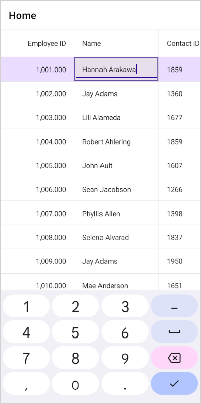

# How to specify a keyboard for a particular column type in MAUI DataGrid?
The [.NET MAUI DataGrid](https://www.syncfusion.com/maui-controls/maui-datagrid) supports the specification of a keyboard for a particular column type.

##### C#

We can customize the keyboard type of the column by specifying the renderer for the column. By overriding the OnCreateEditUIView() method, we can access the edit element of the column, allowing us to set the keyboard type for the entry in this method.

```C#
public class CustomTextBoxRenderer : DataGridTextBoxCellRenderer
{
    protected override SfDataGridEntry OnCreateEditUIView()
    {
        var entry = base.OnCreateEditUIView();
        entry.Keyboard = Keyboard.Numeric;
        return entry;
    }
}
```
Replace the old renderer with the newly customized version. please refer to [Column types UG document](https://help.syncfusion.com/maui/datagrid/column-types) to understand which key corresponds to each type of column.

```C#
public MainPage()
{
    InitializeComponent();
    dataGrid.CellRenderers.Remove("Text");
    dataGrid.CellRenderers.Add("Text", new CustomTextBoxRenderer());
}
```
The following screenshot shows how to specify a keyboard for a particular column type in MAUI DataGrid.



[View sample in GitHub](https://github.com/SyncfusionExamples/How-to-specify-a-keyboard-for-a-particular-column-type-in-MAUI-DataGrid)

Take a moment to pursue this [documentation](https://help.syncfusion.com/maui/datagrid/overview), where you can find more about Syncfusion .NET MAUI DataGrid (SfDataGrid) with code examples.
Please refer to this [link](https://www.syncfusion.com/maui-controls/maui-datagrid) to learn about the essential features of Syncfusion .NET MAUI DataGrid(SfDataGrid).

### Conclusion
I hope you enjoyed learning about how to specify a keyboard for a particular column type in MAUI DataGrid.

You can refer to our [.NET MAUI DataGrid's feature tour](https://www.syncfusion.com/maui-controls/maui-datagrid) page to know about its other groundbreaking feature representations. You can also explore our .NET MAUI DataGrid Documentation to understand how to present and manipulate data.
For current customers, you can check out our .NET MAUI components from the [License and Downloads](https://www.syncfusion.com/account/downloads) page. If you are new to Syncfusion, you can try our 30-day free trial to check out our .NET MAUI DataGrid and other .NET MAUI components.
If you have any queries or require clarifications, please let us know in comments below. You can also contact us through our [support forums](https://www.syncfusion.com/forums), [Direct-Trac](https://support.syncfusion.com/account/login?ReturnUrl=%2Faccount%2Fconnect%2Fauthorize%2Fcallback%3Fclient_id%3Dc54e52f3eb3cde0c3f20474f1bc179ed%26redirect_uri%3Dhttps%253A%252F%252Fsupport.syncfusion.com%252Fagent%252Flogincallback%26response_type%3Dcode%26scope%3Dopenid%2520profile%2520agent.api%2520integration.api%2520offline_access%2520kb.api%26state%3D8db41f98953a4d9ba40407b150ad4cf2%26code_challenge%3DvwHoT64z2h21eP_A9g7JWtr3vp3iPrvSjfh5hN5C7IE%26code_challenge_method%3DS256%26response_mode%3Dquery) or [feedback portal](https://www.syncfusion.com/feedback/maui?control=sfdatagrid). We are always happy to assist you!